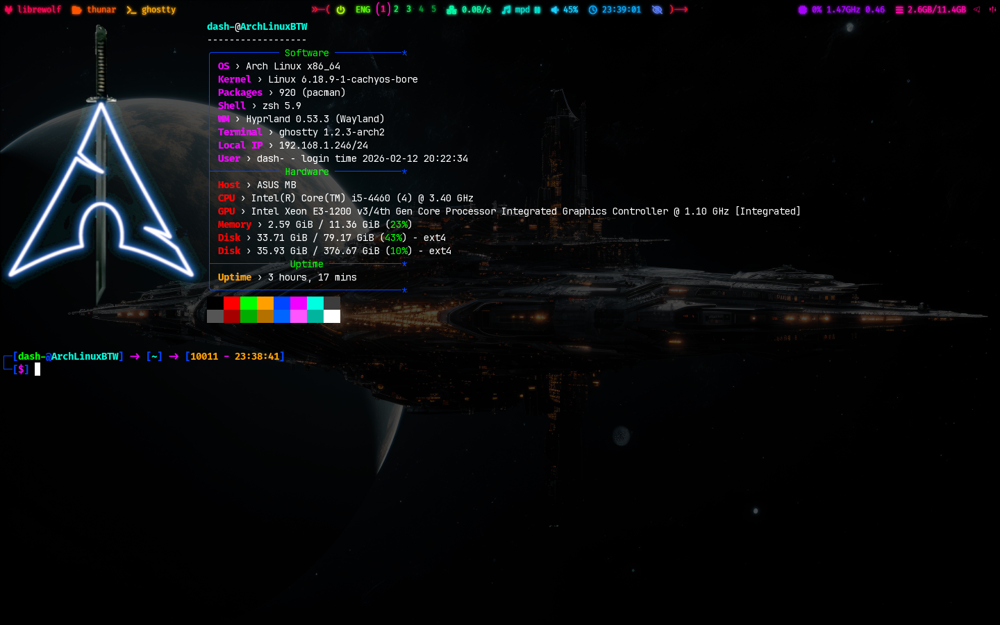

# Hyprland Rice

A complete setup for a customized and modern Wayland desktop experience using **[Hyprland](https://github.com/hyprwm/Hyprland)**.


---

## 🎨 Themes and Customizations

- **GTK Theme:** [Adwaita Dark Amoled](https://www.gnome-look.org/p/1553851)  
  Install in: `~/.themes`

- **Cursor Theme:** [Bibata Modern Classic](https://www.gnome-look.org/p/1914825)  
  Install in: `~/.icons`

- **QT Theme:** [Adwaita Dark](https://www.gnome-look.org/p/1014995/)  
  Install in: `~/.themes`

- **Icon Theme:** [BeautyLine](https://github.com/gvolpe/BeautyLine)  
  Install in: `~/.icons`

- **Font:** [FiraCode](https://github.com/tonsky/FiraCode)  
  Install in: `~/.fonts`

- **Wallpaper:** Spaceship — download image from [here](https://www.vecteezy.com/photo/29163762-3d-cg-rendering-of-space-ship)
  Place in `~/.config/hypr/` and rename to `spaceship.jpg`

- **Waybar:**   [Color](https://github.com/DASH-666/satellite-Hyprland-Dotfile/blob/main/.configs/waybar/style.css) & [thinkpad theme](https://github.com/DASH-666/satellite-Hyprland-Dotfile/blob/main/.configs/waybar/style-thinkpad.css)
 There is 2 theme for waybar.the default is color.but if you like the thinkpad one just rename the style-thinkpad.css to style.css(first rename the last style.css to somthing else ).

---

## ⚙️ Required Packages

### Core Components  
- [Hyprland](https://github.com/hyprwm/Hyprland) — window manager
- [Hypridle](https://github.com/hyprwm/hypridle) — idle manager  
- [Hyprlock](https://github.com/hyprwm/hyprlock) — Lock screen utility  
- [xdg-desktop-portal-hyprland](https://github.com/hyprwm/xdg-desktop-portal-hyprland) — Desktop portal backend for Wayland  
- [libinput](https://github.com/wayland-tablet/libinput) — Input device support  

### Used in Configs  
- [ghostty](https://github.com/ghostty-org/ghostty), [foot](https://codeberg.org/dnkl/foot) — Terminal emulators  
- [waybar](https://github.com/Alexays/Waybar) — Status bar  
- [gtk3](https://docs.gtk.org/gtk3/), [gtk4](https://docs.gtk.org/gtk4/) — GTK toolkits  
- [mako](https://github.com/emersion/mako) — Notification daemon  
- [swaybg](https://github.com/swaywm/swaybg) — Wallpaper/background manager  
- [polkit-gnome](https://gitlab.gnome.org/Archive/policykit-gnome) — PolicyKit authentication agent  
- [rofi](https://github.com/davatorium/rofi) — App launcher (run menu)  
- [playerctl](https://github.com/altdesktop/playerctl) — Media control (MPRIS)  
- [chromium](https://github.com/chromium/chromium), [firefox](https://github.com/mozilla-firefox/firefox) — Web browsers  
- [thunar](https://github.com/neilbrown/thunar), [yazi](https://github.com/sxyazi/yazi) — File managers  
- [cava](https://github.com/karlstav/cava) + [waybar-cava](https://github.com/Alexays/Waybar) — Audio visualizer for Waybar  
- cpupower — CPU power management  
- [btop](https://github.com/aristocratos/btop) — System monitor  
- [networkmanager](https://gitlab.freedesktop.org/NetworkManager/NetworkManager) — Network control (with nmtui)  
- [pavucontrol](https://gitlab.freedesktop.org/pulseaudio/pavucontrol), [pipewire](https://github.com/PipeWire/pipewire), [wireplumber](https://github.com/PipeWire/wireplumber) — Audio stack for Wayland
- [screen shot and record scrips](https://github.com/DASH-666/screen-record-and-shot-script-for-hyprland) — to get screen shot and screen record
- [easyeffects](https://github.com/wwmm/easyeffects) — Audio effects over PipeWire  
- [mpd](https://github.com/MusicPlayerDaemon/MPD), [rmpc](https://github.com/mierak/rmpc), [mpd-mpris](https://github.com/natsukagami/mpd-mpris) — Music player with MPRIS support  
- [wev](https://github.com/jwrdegoede/wev) — Key-code finder for custom keybinds  
- [scrcpy](https://github.com/Genymobile/scrcpy) — Display Android screen on PC
- [nwg-displays](https://github.com/nwg-piotr/nwg-displays) — Output managment
- [librewolf](https://librewolf.net/) — Browser

---

## 💡 Optional Packages (Recommended)  

- [zsh](https://www.zsh.org/), [oh-my-zsh](https://ohmyz.sh/) — Zsh is a shell designed for interactive use
- [neovim](https://neovim.io/) — hyperextensible Vim-based text editor

---
## 🔐 CPU Power Control Fix

To allow cpupower commands to run without a sudo password prompt:
```
sudo visudo
```

Then add this line (replace your_username with your actual username):
```
your_username ALL=(ALL) NOPASSWD: /usr/bin/cpupower
```
## 🛠️ Installation Steps  
1. Install all required dependencies listed above.  
2. Copy themes, icons, fonts, and wallpaper into their respective directories.  
3. Copy configuration folders into `~/.config/`:
4. Reboot your machine.  
5. Select **Hyprland** in your session manager, or run from TTY:  `Hyprland`
6. see `~/.config/hypr/hyprland.conf` for keybinds and enjoy
